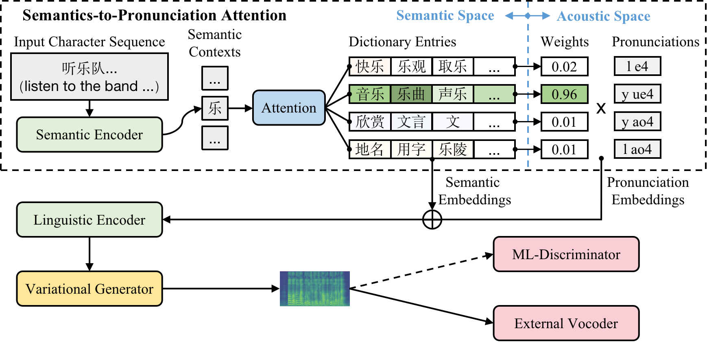

# Dict-TTS: Learning to Pronounce with Prior Dictionary Knowledge for Text-to-Speech




> **Dict-TTS: Learning to Pronounce with Prior Dictionary Knowledge for Text-to-Speech**
> Ziyue Jiang, Su Zhe, Zhou Zhao, Qian Yang, Yi Ren, Jinglin Liu, Zhenhui Ye
> Paper: https://arxiv.org/pdf/2206.02147

<div align="center">


[](https://arxiv.org/pdf/2206.02147)
[](https://github.com/Zain-Jiang/Dict-TTS)


</div>


## Dependencies

**Requirements**
```bash
# Install Python 3 fisrt. (Anaconda recommended)
export PYTHONPATH=.
# build a virtual env
conda create -n dict_tts
conda activate dict_tts
# install requirements
pip install -U pip
pip install Cython numpy>=1.21.4
pip install -r requirements.txt
sudo apt install -y sox libsox-fmt-mp3
```

**Install the aligner (MFA 2.0)**
```bash
# with pip
bash scripts/install_mfa2.sh

# or with conda
conda config --add channels conda-forge
conda install montreal-forced-aligner
```

**Download the datasets (for example, Biaobei)**
Download Biaobei from `https://www.data-baker.com/open source.html` to `data/raw/biaobei`

**Download the pre-trained vocoder**
```
mkdir pretrained
mkdir pretrained/hifigan_hifitts
```
download `model_ckpt_steps_2168000.ckpt`, `config.yaml`, from https://drive.google.com/drive/folders/1n_0tROauyiAYGUDbmoQ__eqyT_G4RvjN?usp=sharing to `pretrained/hifigan_hifitts`

**Download the pre-trained language model**
download `roformer-chinese-base`, from https://huggingface.co/junnyu/roformer_chinese_base to `pretrained/roformer-chinese-base`

**Obtain the dictionary**
You can use the dictionary in ./data/zh-dict.json or crawl the dictionary from the dictionary website mentioned in our paper.


## Quick Start
### Choose the config file (for example, DictTTS's config)
```bash
export CONFIG=egs/datasets/audio/biaobei/dict_tts.yaml 
```
### Preprocess
**Pre-align**
```bash
python data_gen/tts/bin/pre_align.py --config $CONFIG
```
**MFA-align**
```bash
python data_gen/tts/bin/mfa_train.py --config $CONFIG
python data_gen/tts/bin/mfa_align.py --config $CONFIG
```
**Binarize**
```bash
CUDA_VISIBLE_DEVICES=0 python data_gen/tts/bin/binarize.py --config $CONFIG
```

### Train, Infer and Eval
**Train**
```bash
CUDA_VISIBLE_DEVICES=0 python tasks/run.py --config $CONFIG --exp_name dicttts_biaobei_wo_gumbel --reset --hparams="ds_workers=4,max_updates=300000,num_valid_plots=10,use_word_input=True,vocoder_ckpt=pretrained/hifigan_hifitts,max_sentences=60,val_check_interval=2000,valid_infer_interval=2000,binary_data_dir=data/binary/biaobei,word_size=4500,use_dict=True"
```

**Infer (GPU)**
```bash
CUDA_VISIBLE_DEVICES=0 python tasks/run.py --config $CONFIG --exp_name dicttts_biaobei_wo_gumbel --infer --hparams="ds_workers=4,max_updates=300000,num_valid_plots=10,use_word_input=True,vocoder_ckpt=pretrained/hifigan_hifitts,max_sentences=60,val_check_interval=2000,valid_infer_interval=2000,binary_data_dir=data/binary/biaobei,word_size=4500,use_dict=True"
```

**Eval the pronunciation error rate (PER)**
```bash
# The PER of the current version is about 1.93 %.
python scripts/get_pron_error.py
```

## Overall Repository Structure

- `egs`: the config files in the experiments，which is read by `utils/hparams.py`
- `data_gen`: preprocess and binarize the dataset
- `modules`: model
- `scripts`: some scripts used in the experiments
- `tasks`: dataloader, training and inference
- `utils`: utils
- `data`: data folder
    - `raw`: raw files
    - `processed`: preprocessed files
    - `binary`: binary files
- `checkpoints`: checkpoint, tensorboard logs, and inference results。

## Todo

- [ ] The pretrained models
- [ ] The Gumbel softmax version

## Citation

If you find this useful for your research, please cite the following papers:

- Dict-TTS

```bib
@article{jiang2022dict,
  title={Dict-TTS: Learning to Pronounce with Prior Dictionary Knowledge for Text-to-Speech},
  author={Jiang, Ziyue and Zhe, Su and Zhao, Zhou and Yang, Qian and Ren, Yi and Liu, Jinglin and Ye, Zhenhui},
  journal={arXiv preprint arXiv:2206.02147},
  year={2022}
}
```


## Acknowledgments

Our codes are influenced by the following repos:

- [PyTorch Lightning](https://github.com/PyTorchLightning/pytorch-lightning)
- [ParallelWaveGAN](https://github.com/kan-bayashi/ParallelWaveGAN)
- [Hifi-GAN](https://github.com/jik876/hifi-gan)
- [espnet](https://github.com/espnet/espnet)
- [Glow-TTS](https://github.com/jaywalnut310/glow-tts)
- [NATSpeech](https://github.com/NATSpeech/NATSpeech)

## License and Agreement
Any organization or individual is prohibited from using any technology mentioned in this paper to generate someone's speech without his/her consent, including but not limited to government leaders, political figures, and celebrities. If you do not comply with this item, you could be in violation of copyright laws.